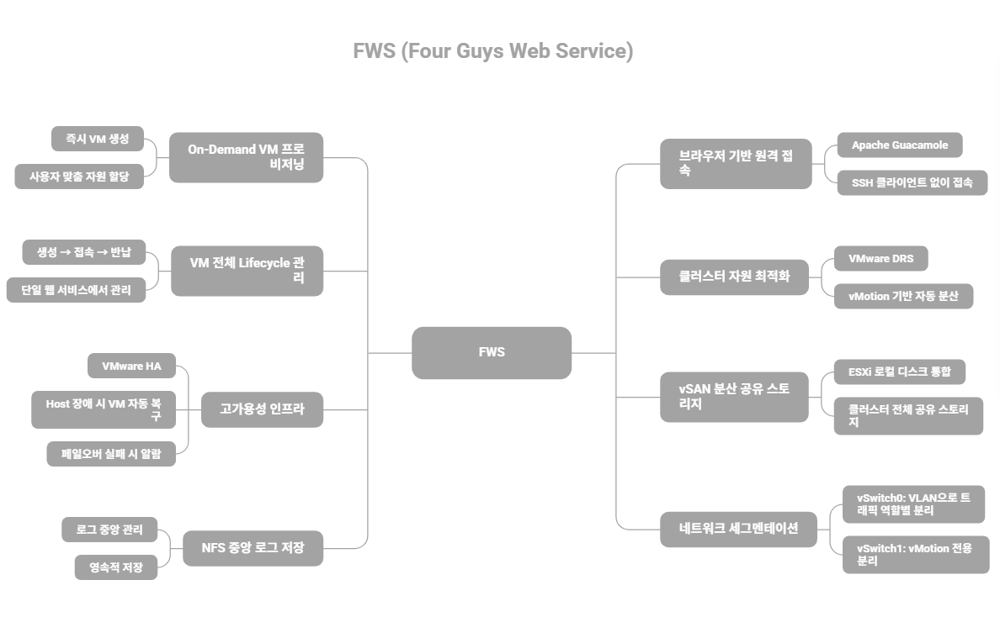
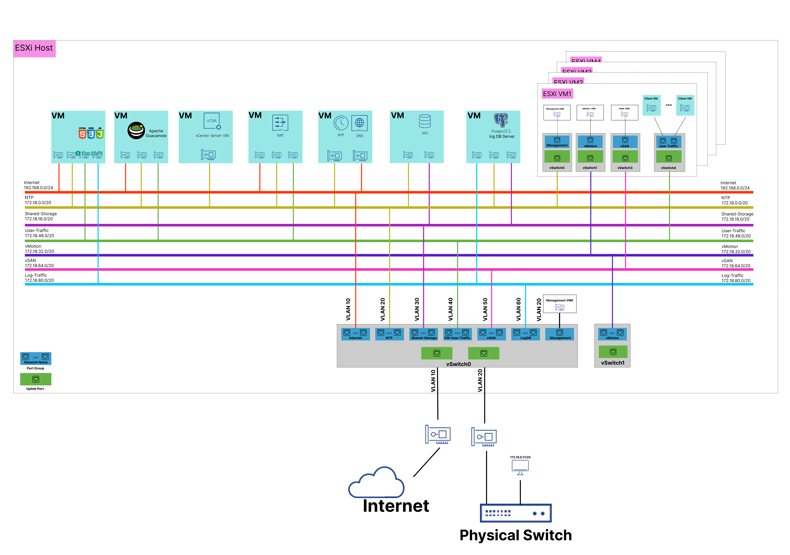
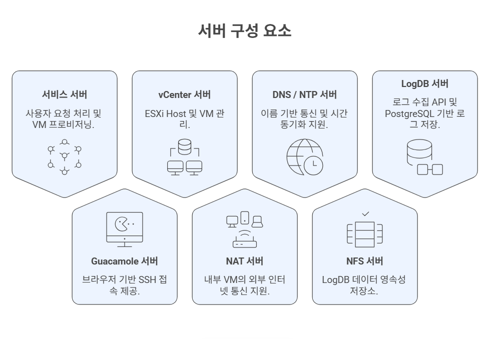
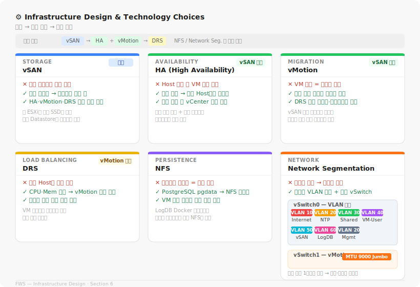
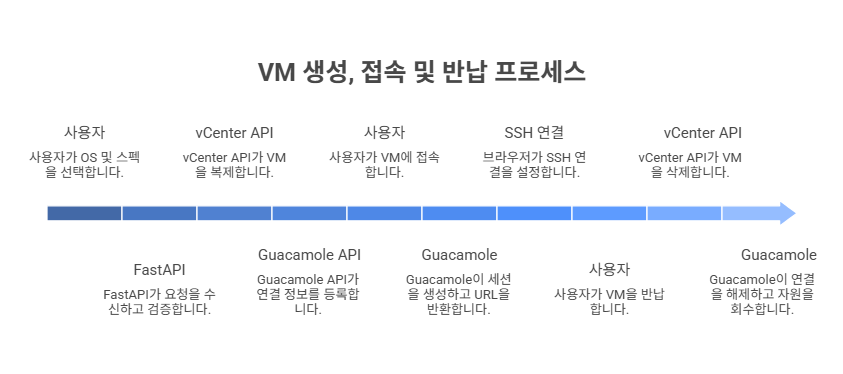
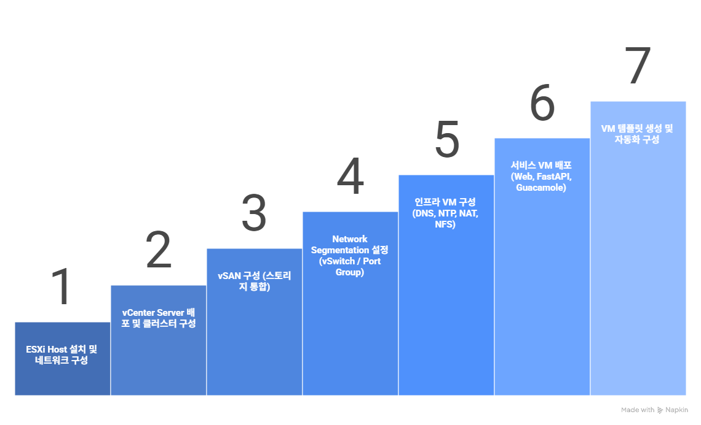

# 🌐 FWS (Four Guys Web Service)

> VMware vSphere 기반 가상화 환경에서 VM 생성, 접속, 반납을 웹으로 통합 제공하는 프라이빗 클라우드형 프로비저닝 플랫폼 

## 1. 📖 Overview
FWS는 VMware vSphere 기반 가상화 인프라에서 사용자 요청에 따라 가상머신을 동적으로 생성하고, 웹 브라우저를 통해 즉시 접속할 수 있도록 지원하는 VM 프로비저닝 플랫폼이다.

본 시스템은 vCenter 기반의 통합 관리 환경 아래 ESXi, vSAN, vMotion, DRS, HA 등의 VMware 핵심 기능을 활용하여 구축되었으며, 프라이빗 클라우드형 VM 운영 환경 제공을 목표로 한다.

---

## 2. 🧩 Key Features



---

## 3. 🏗️ System Architecture



### Nested Environment Design

Nested 구조는 단일 물리 서버 환경에서 다수의 ESXi 호스트로 구성된 VMware 클러스터 환경을 재현하기 위해 적용하였다.

 물리 서버에 직접 설치된 상위 ESXi 호스트는 기반 인프라와 물리 네트워크를 표현하는 역할을 하며, 그 위에 가상머신 형태로 구성된 ESXi 1~4는 실제 개별 물리 서버를 가정한 클러스터 노드로 동작한다. 이를 통해 제한된 하드웨어 환경에서도 vCenter 기반의 통합 관리와 vSAN, vMotion, DRS, HA 등의 클러스터 기능을 구현할 수 있도록 하였다.

---
## 4. 🌐 Network Architecture

본 시스템은 관리, 외부 접속, 사용자 트래픽, 스토리지, 마이그레이션, vSAN, 로그 트래픽을 분리하기 위해 역할별로 vSwitch와 Port Group을 구성하였다.

### Logical Network Segments

| Port Group | CIDR | Purpose |
|------|------|------|
| Internet | 192.168.0.0/24 | 외부 접속 및 서비스 노출 |
| NTP | 172.18.0.0/20 | 시간 동기화 및 기본 인프라 통신 |
| Shared-Storage | 172.18.16.0/20 | 스토리지 전용 네트워크 |
| VMotion | 172.18.32.0/20 | VM 라이브 마이그레이션 트래픽 |
| VM-User-Traffic | 172.18.48.0/20 | 사용자 VM 서비스 트래픽 |
| vSAN-Network | 172.18.64.0/20 | vSAN 클러스터 내부 통신 |
| LogDB | 172.18.80.0/20 | 로그 수집 및 관리 트래픽 |

---

### ESXi Host Virtual Switch Mapping

| vSwitch | Network Name | CIDR | Role | MTU |
| --- | --- | --- | --- | --- |
| vSwitch0 | Internet | 192.168.0.0/24 | 외부 접속 및 인터넷 연결 | 1500 |
|  | NTP | 172.18.0.0/20 | NTP서버 연결 및 vCenter 연동 | 1500 |
|  | Shared-Storage | 172.18.16.0/20 | NFS 기반 공유 스토리지 통신 | 1500 |
|  | VM-User-Traffic | 172.18.48.0/20 | 사용자 VM 및 서비스 트래픽 처리 | 1500 |
|  | vSAN | 172.18.64.0/20 | vSAN 클러스터 내부 스토리지 통신 | 1500 |
|  | LogDB | 172.18.80.0/20 | 로그 저장 및 수집 데이터 전송 | 1500 |
|  | Management | 172.18.0.0/20 | ESXi Host 관리 트래픽 처리 | 1500 |
| vSwitch1 | VMotion | 172.18.32.0/20 | ESXi Host 간 VM 마이그레이션 | 9000 |

---
### VM ESXi Host Virtual Switch Mapping

| vSwitch | Network Name | CIDR | Role | MTU |
| --- | --- | --- | --- | --- |
| vSwitch0 | Internet | 192.168.0.0/24 | 외부 접속 및 인터넷 연결 | 1500 |
|  | NTP | 172.18.0.0/20 | NTP서버 연결 및 vCenter 연동 | 1500 |
|  | Shared-Storage | 172.18.16.0/20 | NFS 기반 공유 스토리지 통신 | 1500 |
|  | VM-User-Traffic | 172.18.48.0/20 | 사용자 VM 및 서비스 트래픽 처리 | 1500 |
|  | vSAN | 172.18.64.0/20 | vSAN 클러스터 내부 스토리지 통신 | 1500 |
|  | LogDB | 172.18.80.0/20 | 로그 저장 및 수집 데이터 전송 | 1500 |
|  | Management | 172.18.0.0/20 | ESXi Host 관리 트래픽 처리 | 1500 |
| vSwitch1 | VMotion | 172.18.32.0/20 | ESXi Host 간 VM 마이그레이션 | 9000 |

---

### Design Rationale

| Category | Purpose |
|----------|---------|
| Traffic Isolation | 관리 트래픽과 사용자 트래픽 간 간섭 방지 |
| Performance | 스토리지 및 클러스터 통신 성능 확보 |
| Fault Containment | 장애 발생 시 영향 범위 최소화 |
| Security & Visibility | 보안성과 운영 가시성 향상 |
| VMware Feature Stability | vMotion, vSAN, HA, DRS의 안정적 동작 보장 |


---

## 5. 🖥️ Virtual Machine Design

본 시스템은 역할별로 VM을 분리하여 구성하였으며, 각 VM은 특정 기능을 담당하고 해당 기능에 맞는 네트워크에 연결되어 있다.  

이를 통해 서비스 계층, 관리 계층, 스토리지 계층을 분리하여 확장성과 안정성을 확보하였다.

---



---

## 6. ⚙️ Infrastructure Design & Technology Choices

본 시스템은 **사용자가 VM을 요청하는 순간부터 반납까지의 전체 라이프사이클을 안정적으로 운영**하는 것을 목표로 설계되었다.  
단순한 VM 생성 도구가 아니라, 프라이빗 클라우드 수준의 자원 관리와 장애 대응이 가능한 환경을 구성하기 위해 다음 기술들을 선택하였다.





---

## 7. 🔄 VM Provisioning Flow



---

## 8. 🛠️ Tech Stack


---

## 9. 🎬 Demo
 
DRS(Distributed Resource Scheduler) 기반의 자동 부하 분산 시나리오를 시연한다.  
VM에 CPU 부하를 인위적으로 발생시켜 DRS가 자동으로 마이그레이션을 수행하고  
클러스터 리소스 불균형을 해소하는 전체 흐름을 확인할 수 있다.

## DRS 데모 영상
<video src="https://github.com/user-attachments/assets/672ea273-c0d5-4355-a2cd-f3ca730a0431" controls width="100%"></video>


## 서비스 데모 영상
<video src="https://github.com/user-attachments/assets/111b69b6-6a75-4ded-81d0-4f081e5a9f15" controls width="100%"></video>

### 시연 흐름
 
| 단계 | 내용 | 설명 |
|:---:|------|------|
| 1️⃣ | **VM 생성** | 웹 페이지에서 OS, 스토리지 설정 후 가상 머신 생성 요청 |
| 2️⃣ | **로그 확인** | 로그 서버에서 VM 생성 요청 및 처리 로그 확인 |
| 3️⃣ | **vCenter 확인** | vCenter에서 VM이 정상적으로 생성되었는지 확인 |
| 4️⃣ | **SSH 접속** | Guacamole을 통해 브라우저에서 생성된 VM에 SSH 접속 |
| 5️⃣ | **VM 삭제** | 웹 페이지에서 VM 반납 후 자원 반환 확인 |

---
 
### 시연 흐름
 
| 단계 | 내용 |
|:---:|------|
| 1️⃣ | **VM CPU 부하 발생** — 특정 VM에 CPU 스트레스 테스트 적용 |
| 2️⃣ | **호스트 CPU 사용량 급증** — 해당 ESXi 호스트의 CPU 사용률 임계치 초과 |
| 3️⃣ | **DRS 점수 하락 확인** — vCenter에서 클러스터 DRS 불균형 점수 확인 |
| 4️⃣ | **DRS 자동화 수준 변경** — DRS 모드를 수동에서 완전 자동화로 전환 |
| 5️⃣ | **DRS 자동 마이그레이션 실행 및 경보 발생** — vMotion을 통한 VM 자동 이동 및 알림 확인 |
| 6️⃣ | **리소스 불균형 해소** — 마이그레이션 완료 후 호스트 간 CPU 부하 균등 분산 확인 |
 
---

## 10. 📂 Project Structure

```bash
.
├── FWS-log            # log 서버
├── FWS-server         # FastAPI 서버
├── FWS-web            # Web Service (HTML, CSS, JS)
└── README.md
```

---

## 11. 🚀 Deployment

본 시스템은 VMware 기반 가상화 환경 위에 구성되며 다음과 같은 순서로 구축된다.




---

## 12. 📊 Future Work

- 사용자 인증 및 권한 관리 기능 추가
- VM 사용량 기반 과금 시스템 설계
- Kubernetes 기반 컨테이너 환경 확장
- 모니터링 시스템 (Prometheus, Grafana) 도입
- 로그 분석 및 자동화 시스템 구축
- Auto Scaling 및 정책 기반 자원 할당
---

## 팀 AllIsWell
| |  | |   |
|:--:|:--:|:--:|:--:|
| [**심규보**](https://github.com/Qbooo) | [**류승환**](https://github.com/Federico-15) | [**박성준**](https://github.com/Sungjun24s) | [**이승준**](https://github.com/HiLeeS) |

- 역할 분담
- 심규보: 서비스 백엔드/프론트엔드, 로그 백엔드, NFS 연결, 네트워크 아키텍쳐 설계

---

## 13. 📌 References
- 사용 기술 문서
- 참고 자료


